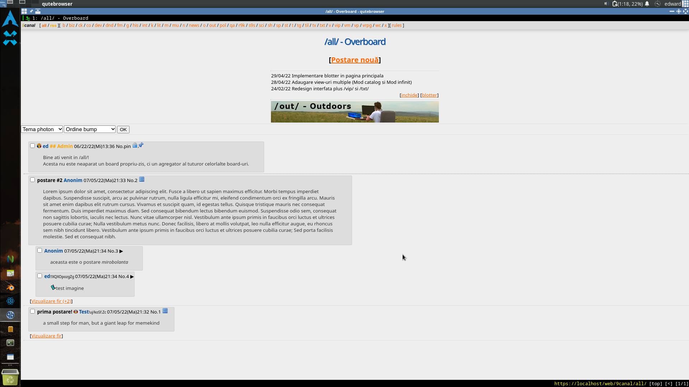
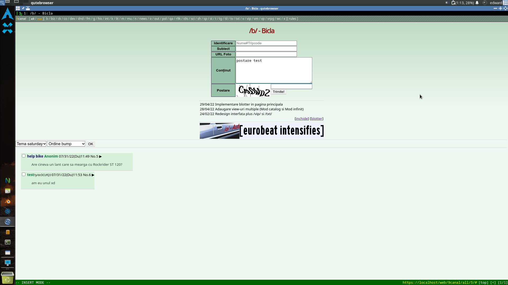
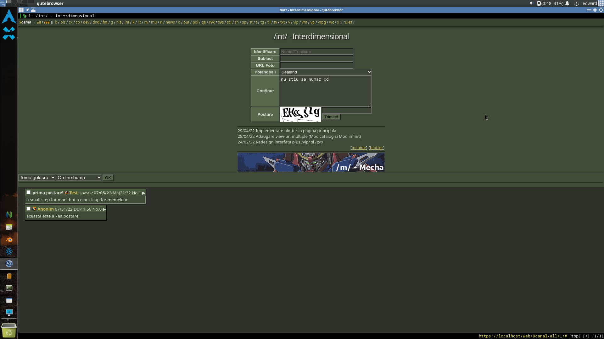
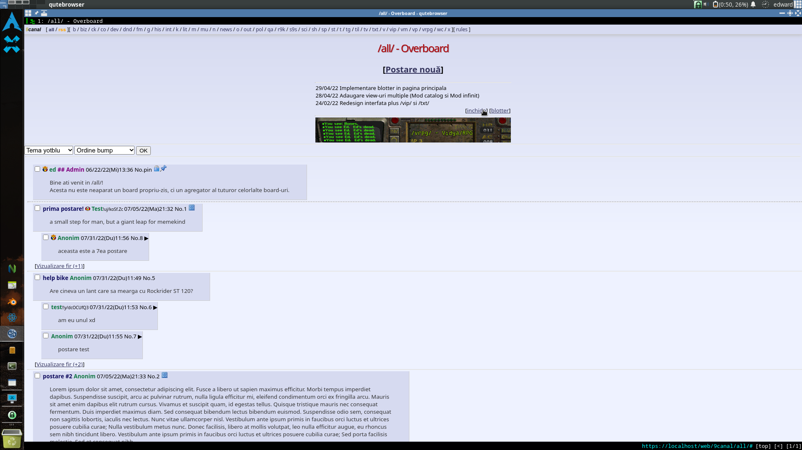

# 9canal
Forum anonim cu sistem de board-uri, teme, bump-uri, parole temporare, banner-uri, blotter, etc.

# Screenshot-uri

# Configurare
`$ mkdir all`

`$ cd all`

`$ ln -sf ../index.php ./index.php`

`$ cd ..`

`$ sudo chown -R http */`

`$ sudo chown -R http postnum.txt`

Este recomandat sa rulati `reset.sh` cand clonati repo-ul prima oara.
